<p align="center">
  
</p>

<div align="center">


**大连理工大学开发区校区黑蚁极限飞盘队 · 官方网站**

[🌐 官网](https://dutultimate.club/) · [📋 项目状态](PROJECT_STATUS.md) · [📖 部署文档](docs/CLOUDBASE_DEPLOYMENT.md)

</div>


---


## ✨ 功能亮点

| 特性 | 说明 |
|------|------|
| 👥 **成员审核系统** | 匿名登录提交资料，管理员审核后公开显示 |
| 📸 **照片图库** | 队友日常照片上传与发布流程 |
| 🏆 **首次比赛登记** | 公开成员登记正式比赛经历 |
| 📱 **二维码管理** | 官网、后台、照片页主题海报二维码生成 |
| ☁️ **CloudBase 托管** | 腾讯云 CloudBase 公开网站托管与数据持久化 |


---


原生页面已接入腾讯云 CloudBase，用于公开网站托管、成员资料持久化、头像存储和管理员审核。

长期宣传域名：<https://dutultimate.club/>。CloudBase 默认域名继续保留，确保已经印刷或分享的旧二维码仍可访问。

继续迭代前请先阅读 [PROJECT_STATUS.md](PROJECT_STATUS.md)，其中记录当前线上版本、功能状态、约束和下一步工作。

## 本地运行

```bash
npm ci
copy .env.example .env
npm run dev
```

在 `.env` 中填写 CloudBase 环境 ID、Publishable Key 和管理员 UID。未配置云端时页面仍可预览，但成员提交和审核功能会保持关闭。

## 常用命令

```bash
npm run dev          # 本地开发
npm run check        # 单元测试 + 生产构建
npm run qrcodes:generate
npm run verify:live  # 校验线上页面、规则链接和二维码
npm run preview      # 预览生产构建
npm run cloudbase:login
npm run cloudbase:deploy
```

## 云端数据流

1. 访客匿名登录后提交审核用真实姓名、公开昵称、入学年份、入社年份和压缩头像；真实姓名与昵称分别保持唯一，且二者不能相同。
2. `member-api` 云函数校验资料，通过 `member_identity_claims` 原子占用姓名后写入 `members` 集合，状态为 `pending`。
3. 单管理员在 `/admin.html` 审核。
4. 只有 `approved` 记录会显示在公开名册，公开接口不会返回真实姓名。
5. 数据库和云存储禁止浏览器直接读写，所有操作均经过云函数。
6. 队友从 `/photos.html` 提交日常照片，管理员在同一后台审核后发布到主站图库。
7. 已公开成员从 `/debut.html` 登记首次代表社团参加的正式比赛；后台会提示提交身份是否与成员申请一致，管理员核实后，该成员进入“黑蚁飞盘队”分区并仅公开入队年份。

官网、审核后台、照片上传页和首次比赛登记页的主题海报、标准二维码及下载入口位于 `/qrcodes.html`。

完整开通、部署、备案及运维步骤见 [docs/CLOUDBASE_DEPLOYMENT.md](docs/CLOUDBASE_DEPLOYMENT.md)。


---

<div align="center">

**Made with ❤️ by BLACK ANTS**

</div>
